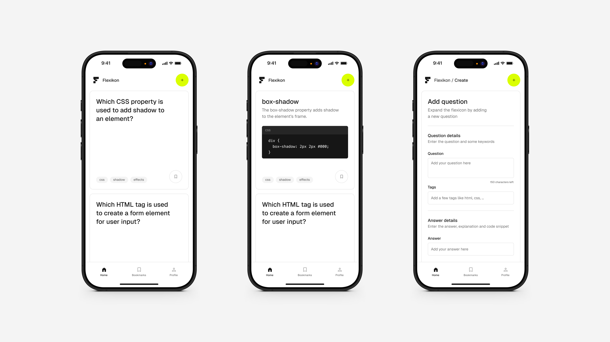

# Flexikon

Vanilla JavaScript app to explore web technologies interactively, test knowledge, and contribute new questions.



## Features

-   **Interactive Quizzes:** Test knowledge of modern web technologies
-   **Custom Questions:** Add new questions to expand the learning experience

## Technologies

-   **Markup:** [HTML](https://developer.mozilla.org/de/docs/Web/HTML)
-   **Styling:** [CSS](https://developer.mozilla.org/de/docs/Web/CSS)
-   **Interaction:** [JS](https://developer.mozilla.org/de/docs/Web/JavaScript)

## Questions

This project uses **ChatGPT** to generate quiz questions. Below is the exact prompt used to create new questions.

<details>
    <summary>Show prompt</summary>

    Hey, please pretend to be a html, css and javascript expert because I want you to help me create a random question either html, css or javascript related for a quiz. Here's an example:

    Question (maximum of 80 characters):
    Which CSS property can be used to invert the flexbox axes?

    Answer (single line, only the html tag/css/js attribute):
    flex-direction

    Explanation (maximum of 80 characters):
    The flex-direction property specifies the direction of the flexible items.

    Code language (single word, CSS, HTML or JS):
    CSS

    Code (maximum of 120 characters, each line individually):
    div {
    display: flex;
    flex-direction: column;
    }

    Attention: in case your code has some html tags in it, make sure to replace the < > with `&lt;` and `&gt;`

    Tags (maximum of 3, only one word each):
    html
    css
    js

    Could you please give me 6 questions back as a single JSON object, so that I can work on with it.

</details>

## Getting Started

### Prerequisites

This project has no additional requirements.

### Installation

1. Clone the repository:

    ```bash
    git clone https://github.com/benjaminpfleghaar/flexikon.git
    ```

2. Run the development server:

    ```bash
    npm run start
    ```
